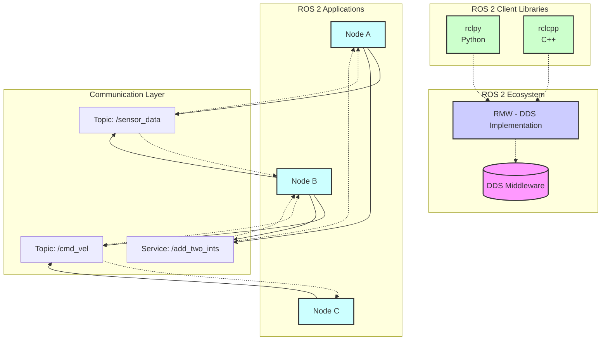
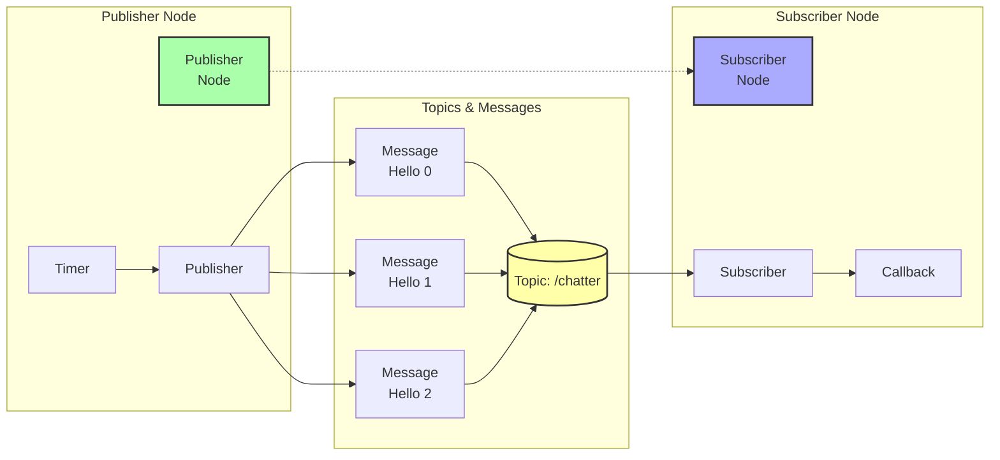
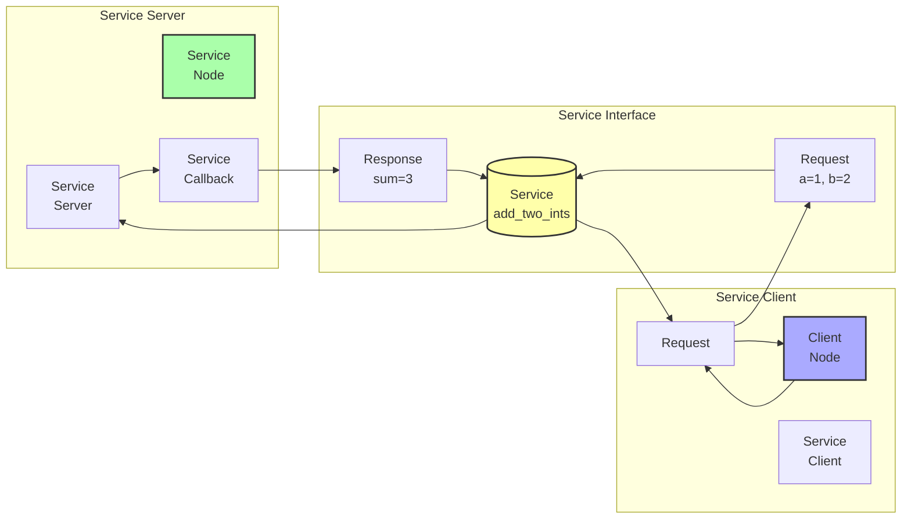
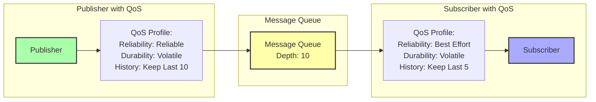

# Architecture Diagrams

## ROS 2 Architecture Overview



## Node-Topic-Service Communication Pattern



## Service Client-Server Pattern



## URDF Robot Model Structure

```mermaid
graph TD
    Robot[Robot Element<br/>name="simple_robot"]
    
    subgraph "Links"
        Base[Link<br/>base_link]
        Wheel1[Link<br/>wheel_1]
        Wheel2[Link<br/>wheel_2]
        Castor[Link<br/>castor_wheel]
    end
    
    subgraph "Joints"
        J1[Joint<br/>base_to_wheel1<br/>continuous]
        J2[Joint<br/>base_to_wheel2<br/>continuous]
        J3[Joint<br/>base_to_castor<br/>fixed]
    end
    
    Robot --> Base
    Robot --> J1
    Robot --> J2
    Robot --> J3
    
    J1 --> Base
    J1 --> Wheel1
    J2 --> Base
    J2 --> Wheel2
    J3 --> Base
    J3 --> Castor
    
    style Robot fill:#ffaaaa,stroke:#333,stroke-width:2px
    style Base fill:#aaffaa,stroke:#333,stroke-width:2px
    style Wheel1 fill:#aaffaa,stroke:#333,stroke-width:2px
    style Wheel2 fill:#aaffaa,stroke:#333,stroke-width:2px
    style Castor fill:#aaffaa,stroke:#333,stroke-width:2px
    style J1 fill:#aaaaff,stroke:#333,stroke-width:2px
    style J2 fill:#aaaaff,stroke:#333,stroke-width:2px
    style J3 fill:#aaaaff,stroke:#333,stroke-width:2px
```

## Lifecycle of a ROS 2 Node

```mermaid
stateDiagram-v2
    [*] --> Unconfigured
    Unconfigured --> Inactive: create_node()
    Inactive --> Active: activate()
    Active --> Inactive: deactivate()
    Inactive --> Unconfigured: cleanup()
    Unconfigured --> Finalized: destroy_node()
    
    Active --> Error: error()
    Inactive --> Error: error()
    Unconfigured --> Error: error()
    Error --> [*]
    
    note right of Active
        : spin()
        : processing callbacks
    end
```

## Quality of Service (QoS) Settings Impact

