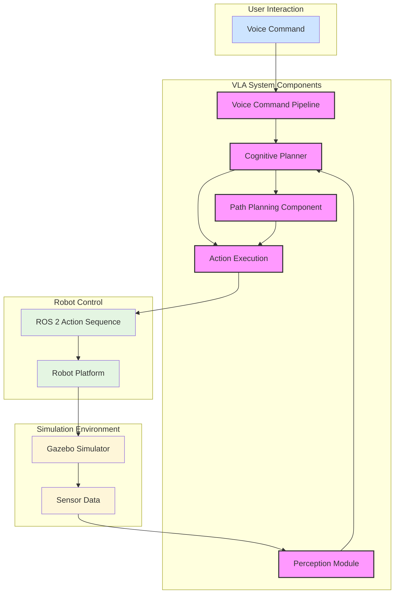

# VLA System Architecture Diagram

## Component Descriptions

1. **Voice Command Pipeline**: Processes audio input using OpenAI Whisper to convert speech to text
2. **Cognitive Planner**: Uses LLMs to translate natural language commands into action sequences
3. **Perception Module**: Processes visual input to detect and identify objects in the environment
4. **Path Planning Component**: Determines optimal navigation routes based on environmental perception
5. **Action Execution**: Coordinates the execution of action sequences on the robot platform
6. **ROS 2 Action Sequence**: Standardized format for robot commands in the ROS 2 ecosystem
7. **Robot Platform**: Physical or simulated robot that executes the commands
8. **Gazebo Simulator**: Simulation environment for testing VLA systems
9. **Sensor Data**: Input from robot sensors (cameras, lidar, etc.) processed by perception module