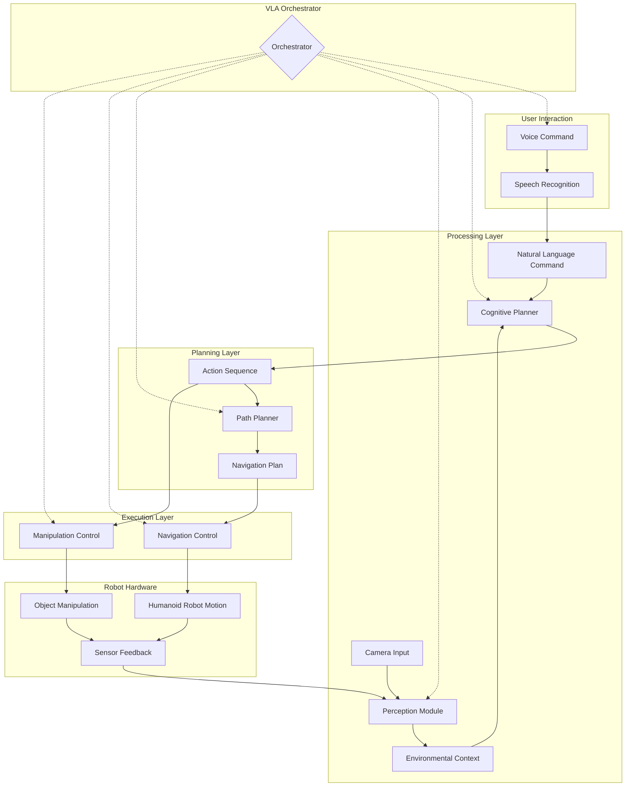

# Complete VLA System Architecture

## Overview

The Vision-Language-Action (VLA) system architecture presented here integrates all components into a cohesive system that can process natural language commands, perceive the environment, plan actions, and execute them on a humanoid robot. This architecture serves as the foundation for the capstone project in this module.

## System Components

The complete VLA system consists of several interconnected modules:

### 1. Voice Command Pipeline
- **Components**: Audio input, speech recognition (Whisper), natural language processing
- **Function**: Converts spoken commands to text and processes them for action planning
- **Output**: Natural language command text sent to cognitive planner

### 2. Cognitive Planning System
- **Components**: LLM interface, context manager, action validator
- **Function**: Interprets natural language and generates action sequences
- **Output**: Sequenced actions for execution

### 3. Perception Module
- **Components**: Object detection, environment mapping, sensor fusion
- **Function**: Interprets visual input and identifies objects and obstacles
- **Output**: Environmental context and object positions

### 4. Path Planning Component
- **Components**: Navigation stack, obstacle avoidance, route optimization
- **Function**: Plans safe and efficient paths to destinations
- **Output**: Navigation trajectories

### 5. Manipulation System
- **Components**: Arm control, grasp planning, force control
- **Function**: Controls robot end-effectors for object interaction
- **Output**: Manipulation actions

### 6. VLA System Orchestrator
- **Components**: Command routing, state management, error handling
- **Function**: Coordinates all components and manages system state
- **Output**: Integrated system behavior

## Architecture Diagram



## Integration Points

### Voice Pipeline Integration
The voice command pipeline integrates with the cognitive planner through:

1. Natural language commands are published to `/vla/natural_command` topic
2. The cognitive planner subscribes to this topic to receive commands
3. The cognitive planner processes the command and generates an action sequence
4. Action sequences are published to `/vla/action_sequence` topic

### Perception Integration
The perception module provides environmental context to the cognitive planner:

1. Object detection results are published to `/vla/perception/objects` topic
2. The cognitive planner uses this information when generating action sequences
3. Real-time updates allow for adaptive planning based on environmental changes

### Path Planning Integration
The path planning component integrates with navigation:

1. When the cognitive planner generates a `navigate_to` action, it sends the target to the path planner
2. The path planner generates a navigation trajectory using ROS 2 Navigation stack
3. The navigation control module executes the trajectory while monitoring for obstacles

## Component Interfaces

### ROS 2 Topics and Services

#### Published Topics:
- `/vla/natural_command` - Natural language commands from voice pipeline
- `/vla/action_sequence` - Action sequences from cognitive planner  
- `/vla/perception/objects` - Detected objects from perception module
- `/vla/status` - System status updates
- `/cmd_vel` - Velocity commands for robot movement
- `/joint_commands` - Joint position commands for manipulation

#### Subscribed Topics:
- `/audio_input` - Raw audio data from microphone
- `/camera/image_raw` - Camera images for perception
- `/scan` - Laser scan data for navigation
- `/joint_states` - Robot joint position feedback

#### Services:
- `transcribe_audio` - Service for speech-to-text conversion
- `plan_cognitive_task` - Service to request cognitive planning
- `get_path` - Service to request path planning
- `execute_action` - Service to execute specific actions

### Message Types

Custom message types defined for the VLA system:

```python
# ActionSequence.msg
string request_id
string command
VLAAction[] actions

# VLAAction.msg
string type
string params
string description
float32 confidence

# DetectedObjects.msg
Header header
Object[] objects

# Object.msg
string name
geometry_msgs/Point position
geometry_msgs/Pose pose
float32 confidence
```

## System States and State Management

The VLA system maintains several state variables:

1. **System State**: IDLE, LISTENING, PROCESSING, EXECUTING, ERROR
2. **Robot State**: Position, battery level, currently holding object
3. **Environment State**: Detected objects, obstacles, safe zones
4. **Command State**: Current command, action sequence in progress

State transitions occur based on component outputs and system events.

## Safety and Validation Layer

The architecture includes multiple safety layers:

1. **Pre-execution Validation**: Action sequences are validated before execution
2. **Real-time Monitoring**: System monitors execution for safety violations
3. **Emergency Stop**: Mechanism to halt execution if safety is compromised
4. **Recovery Procedures**: Automatic recovery from common failures

## Performance Considerations

### Latency Management
- Voice processing:  &lt;200ms for real-time responsiveness
- Cognitive planning:  &lt;2s for complex commands
- Path planning:  &lt;500ms for route calculation
- Action execution: Immediate response to high-priority commands

### Resource Optimization
- Asynchronous processing of perception and planning
- Caching of frequently requested information
- Efficient memory management for continuous operation
- Load balancing between different processing components

## Fault Tolerance and Recovery

The system incorporates fault tolerance through:

1. **Component Isolation**: Failure in one component doesn't bring down the entire system
2. **Fallback Mechanisms**: Alternative approaches when primary methods fail
3. **State Recovery**: Ability to resume operations from last known safe state
4. **Error Logging**: Comprehensive logging for diagnostics and improvement

## Simulation Integration

For the capstone project, the architecture supports simulation through:

1. **Gazebo Integration**: Full physics simulation of robot and environment
2. **Sensor Simulation**: Accurate simulation of cameras, LiDAR, and other sensors
3. **ROS Bridge**: Seamless transition between simulation and real hardware
4. **Scenarios**: Predefined test scenarios for validation

## Conclusion

This architecture provides a robust foundation for the complete VLA system, enabling integration of vision, language, and action capabilities in a humanoid robot. The modular design allows for independent development and testing of components while ensuring cohesive system operation. The architecture emphasizes safety, performance, and extensibility for future enhancements.