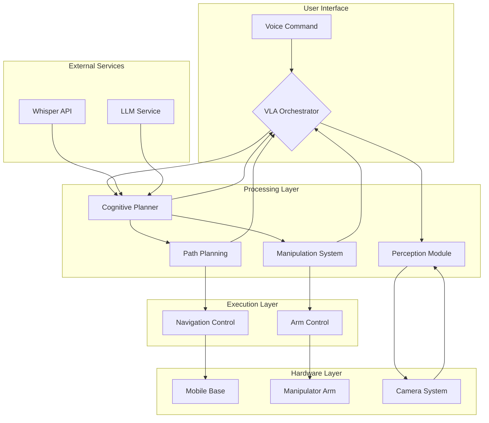

# Complete VLA System Integration

## Overview

This document describes the integration of all components into a complete Vision-Language-Action (VLA) system. The integration combines the voice command pipeline, cognitive planner, perception module, path planning component, manipulation system, and system orchestrator into a cohesive system that can process natural language commands and execute complex robotic tasks.

## Integration Architecture

### System Integration Diagram



### Message Flow Integration

The complete VLA system integrates using the following key ROS 2 topics and services:

#### Published Topics:
- `/vla/natural_command` - Natural language commands from voice pipeline
- `/vla/action_sequence` - Action sequences from cognitive planner
- `/vla/perception/objects` - Detected objects from perception module
- `/vla/status` - System status updates
- `/cmd_vel` - Velocity commands for navigation
- `/joint_commands` - Joint position commands for manipulation

#### Subscribed Topics:
- `/audio_input` - Raw audio data from microphone
- `/camera/image_raw` - Camera images for perception
- `/scan` - Laser scan data for navigation
- `/joint_states` - Robot joint position feedback

#### Services:
- `plan_cognitive_task` - Request cognitive planning
- `get_path` - Request path planning
- `execute_action` - Request action execution
- `transcribe_audio` - Request speech-to-text conversion

## Complete System Launch

### System Integration Launch File

```xml
<!-- launch/vla_complete_system.launch.py -->
from launch import LaunchDescription
from launch_ros.actions import Node, ComposableNodeContainer
from launch.actions import DeclareLaunchArgument
from launch.substitutions import LaunchConfiguration
from launch.conditions import IfCondition
from launch_ros.descriptions import ComposableNode


def generate_launch_description():
    # Launch configuration
    use_sim_time = LaunchConfiguration('use_sim_time', default='false')
    openai_api_key = LaunchConfiguration('openai_api_key', default='')
    debug_mode = LaunchConfiguration('debug_mode', default='false')
    
    # Create the main orchestrator node
    orchestrator_node = Node(
        package='vla_examples',
        executable='vla_system_orchestrator',
        name='vla_system_orchestrator',
        parameters=[
            {'use_sim_time': use_sim_time}
        ],
        remappings=[
            ('/map', '/map'),
            ('/scan', '/scan'),
            ('/camera/image_raw', '/camera/image_raw'),
            ('/audio_input', '/audio_input'),
        ],
        output='screen'
    )
    
    # Voice command pipeline
    voice_command_node = Node(
        package='vla_examples',
        executable='voice_command_node',
        name='voice_command_node',
        parameters=[
            {'use_sim_time': use_sim_time}
        ],
        remappings=[
            ('/audio_input', '/audio_input'),
        ],
        output='screen'
    )
    
    # Cognitive planner
    cognitive_planner_node = Node(
        package='vla_examples',
        executable='voice_aware_cognitive_planner',
        name='voice_aware_cognitive_planner',
        parameters=[
            {'use_sim_time': use_sim_time},
            {'openai_api_key': openai_api_key}
        ],
        remappings=[
            ('/camera/image_raw', '/camera/image_raw'),
        ],
        output='screen'
    )
    
    # Perception module
    perception_node = Node(
        package='vla_examples',
        executable='perception_module',
        name='perception_module',
        parameters=[
            {'use_sim_time': use_sim_time}
        ],
        remappings=[
            ('/camera/image_raw', '/camera/image_raw'),
            ('/camera/camera_info', '/camera/camera_info'),
        ],
        output='screen'
    )
    
    # Path planning component
    path_planning_node = Node(
        package='vla_examples',
        executable='path_planning_component',
        name='path_planning_component',
        parameters=[
            {'use_sim_time': use_sim_time}
        ],
        remappings=[
            ('/map', '/map'),
            ('/scan', '/scan'),
            ('/odom', '/odom'),
        ],
        output='screen'
    )
    
    # Manipulation system
    manipulation_node = Node(
        package='vla_examples',
        executable='manipulation_system',
        name='manipulation_system',
        parameters=[
            {'use_sim_time': use_sim_time}
        ],
        remappings=[
            ('/joint_states', '/joint_states'),
            ('/wrench', '/wrench'),
        ],
        output='screen'
    )
    
    # Create launch description
    ld = LaunchDescription([
        # Declare launch arguments
        DeclareLaunchArgument(
            'use_sim_time',
            default_value='false',
            description='Use simulation clock if true'
        ),
        DeclareLaunchArgument(
            'openai_api_key',
            default_value='',
            description='OpenAI API key for cognitive planner'
        ),
        DeclareLaunchArgument(
            'debug_mode',
            default_value='false',
            description='Enable debug output'
        ),
        
        # Launch all nodes
        orchestrator_node,
        voice_command_node,
        cognitive_planner_node,
        perception_node,
        path_planning_node,
        manipulation_node,
    ])
    
    return ld
```

### System Integration Node

```python
#!/usr/bin/env python3
"""
Complete VLA System Integration Node

This node orchestrates the complete VLA system by coordinating all components
and ensuring proper message flow between them.
"""

import rclpy
from rclpy.node import Node
from rclpy.qos import QoSProfile
from std_msgs.msg import String, Bool
from geometry_msgs.msg import Twist, PoseStamped
from sensor_msgs.msg import Image, LaserScan, JointState
from nav_msgs.msg import Odometry
from vla_msgs.msg import ActionSequence, VLAAction, DetectedObjects
from vla_msgs.srv import ExecuteAction, PlanCognitiveTask, GetPath
from tf2_ros import TransformException
from tf2_ros.buffer import Buffer
from tf2_ros.transform_listener import TransformListener
import json
import time
import threading
from enum import Enum
from typing import Dict, List, Optional, Any


class SystemState(Enum):
    """System states for the complete VLA system"""
    IDLE = "idle"
    PROCESSING_COMMAND = "processing_command"
    EXECUTING_ACTION = "executing_action"
    NAVIGATING = "navigating"
    MANIPULATING = "manipulating"
    ERROR = "error"
    SAFETY_STOP = "safety_stop"


class CompleteVLASystem(Node):
    """
    Complete VLA system integration node
    """
    
    def __init__(self):
        super().__init__('complete_vla_system')
        
        # Initialize system components
        self.qos_profile = QoSProfile(depth=10)
        
        # TF2 setup for coordinate transformations
        self.tf_buffer = Buffer()
        self.tf_listener = TransformListener(self.tf_buffer, self)
        
        # State management
        self.system_state = SystemState.IDLE
        self.current_action_sequence = []
        self.current_action_index = 0
        self.is_executing = False
        self.emergency_stop = False
        self.command_queue = []
        
        # Component status tracking
        self.components_ready = {
            'voice_command': False,
            'cognitive_planner': False,
            'perception': False,
            'path_planning': False,
            'manipulation': False,
            'navigation': False
        }
        
        # Publishers
        self.status_publisher = self.create_publisher(
            String,
            '/vla_system/status',
            self.qos_profile
        )
        
        self.cmd_vel_publisher = self.create_publisher(
            Twist,
            '/cmd_vel',
            self.qos_profile
        )
        
        # Subscribers
        self.natural_command_subscriber = self.create_subscription(
            String,
            '/vla/natural_command',
            self.natural_command_callback,
            self.qos_profile
        )
        
        self.action_sequence_subscriber = self.create_subscription(
            ActionSequence,
            '/vla/action_sequence',
            self.action_sequence_callback,
            self.qos_profile
        )
        
        self.detected_objects_subscriber = self.create_subscription(
            DetectedObjects,
            '/vla/perception/objects',
            self.detected_objects_callback,
            self.qos_profile
        )
        
        self.system_status_subscriber = self.create_subscription(
            String,
            '/vla/status',
            self.system_status_callback,
            self.qos_profile
        )
        
        # Service clients for communication with components
        self.cognitive_planner_client = self.create_client(
            PlanCognitiveTask,
            'plan_cognitive_task'
        )
        
        self.path_planner_client = self.create_client(
            GetPath,
            'get_path'
        )
        
        self.action_executor_client = self.create_client(
            ExecuteAction,
            'execute_action'
        )
        
        # Timers for periodic tasks
        self.status_timer = self.create_timer(1.0, self.publish_system_status)
        self.health_check_timer = self.create_timer(5.0, self.check_component_health)
        
        # Wait for all services to be available
        self.wait_for_services()
        
        # Start command processing thread
        self.command_processing_thread = threading.Thread(target=self.process_command_queue, daemon=True)
        self.command_processing_thread.start()
        
        self.get_logger().info('Complete VLA System initialized and ready')
        self.update_system_status(SystemState.IDLE, "System initialized and waiting for commands")
    
    def wait_for_services(self):
        """Wait for all required services to be available"""
        services = [
            (self.cognitive_planner_client, "Cognitive Planner"),
            (self.path_planner_client, "Path Planner"),
            (self.action_executor_client, "Action Executor")
        ]
        
        for client, name in services:
            while not client.wait_for_service(timeout_sec=1.0):
                self.get_logger().info(f'{name} service not available, waiting again...')
        
        self.get_logger().info('All required services are available')
    
    def update_system_status(self, new_state: SystemState, message: str = ""):
        """Update system state and publish status"""
        old_state = self.system_state
        self.system_state = new_state
        
        status_msg = String()
        status_msg.data = json.dumps({
            'state': new_state.value,
            'timestamp': time.time(),
            'message': message,
            'components_ready': self.components_ready
        })
        
        self.status_publisher.publish(status_msg)
        self.get_logger().info(f'System state changed from {old_state.value} to {new_state.value}: {message}')
    
    def natural_command_callback(self, msg: String):
        """Handle natural language commands"""
        command = msg.data
        self.get_logger().info(f'Received natural command: {command}')
        
        if self.emergency_stop:
            self.get_logger().warn('Emergency stop active, ignoring command')
            return
        
        # Add command to queue to be processed by the command processing thread
        self.command_queue.append(command)
    
    def process_command_queue(self):
        """Process commands from the queue in a separate thread"""
        while True:
            if self.command_queue and not self.is_executing and not self.emergency_stop:
                command = self.command_queue.pop(0)
                
                # Plan action sequence for the command
                self.update_system_status(SystemState.PROCESSING_COMMAND, f"Planning for: {command}")
                
                future = self.cognitive_planner_client.call_async(
                    PlanCognitiveTask.Request(command=command)
                )
                
                # Wait for planning to complete
                rclpy.spin_until_future_complete(self, future, timeout_sec=10.0)
                
                try:
                    response = future.result()
                    if response.success:
                        self.get_logger().info(f'Cognitive planning successful, got {len(response.action_sequence.actions)} actions')
                        
                        # Store the action sequence and begin execution
                        self.current_action_sequence = response.action_sequence.actions
                        self.current_action_index = 0
                        self.is_executing = True
                        self.execute_next_action()
                    else:
                        self.get_logger().error(f'Cognitive planning failed: {response.message}')
                        self.update_system_status(SystemState.ERROR, f"Planning failed: {response.message}")
                except Exception as e:
                    self.get_logger().error(f'Error in cognitive planning: {e}')
                    self.update_system_status(SystemState.ERROR, f"Planning error: {e}")
            else:
                time.sleep(0.1)  # Avoid busy waiting
    
    def execute_next_action(self):
        """Execute the next action in the sequence"""
        if self.current_action_index >= len(self.current_action_sequence):
            # Sequence completed
            self.get_logger().info('Action sequence completed')
            self.current_action_index = 0
            self.current_action_sequence = []
            self.is_executing = False
            self.update_system_status(SystemState.IDLE, "Action sequence completed successfully")
            return
        
        if self.emergency_stop:
            self.get_logger().info('Emergency stop during execution')
            self.update_system_status(SystemState.SAFETY_STOP, "Execution stopped due to safety stop")
            return
        
        # Get the next action
        action = self.current_action_sequence[self.current_action_index]
        self.get_logger().info(f'Executing action {self.current_action_index + 1}/{len(self.current_action_sequence)}: {action.type}')
        
        # Update status based on action type
        if action.type in ['navigate_to', 'move_to']:
            self.update_system_status(SystemState.NAVIGATING, f"Performing navigation: {action.description}")
        elif action.type in ['grasp', 'place_at', 'release']:
            self.update_system_status(SystemState.MANIPULATING, f"Performing manipulation: {action.description}")
        else:
            self.update_system_status(SystemState.EXECUTING_ACTION, f"Executing: {action.description}")
        
        # Create action execution request
        request = ExecuteAction.Request()
        request.action = action
        
        # Execute the action
        future = self.action_executor_client.call_async(request)
        future.add_done_callback(self.action_execution_callback)
    
    def action_execution_callback(self, future):
        """Handle response from action executor"""
        try:
            response = future.result()
            if response.success:
                self.get_logger().info(f'Action executed successfully: {response.message}')
                
                # Move to next action
                self.current_action_index += 1
                self.execute_next_action()
            else:
                self.get_logger().error(f'Action execution failed: {response.message}')
                
                # Stop execution and handle error
                self.is_executing = False
                self.update_system_status(SystemState.ERROR, f"Action failed: {response.message}")
                
                # Attempt recovery or error handling
                self.handle_action_failure(response.error_code)
                
        except Exception as e:
            self.get_logger().error(f'Error in action execution callback: {e}')
            self.is_executing = False
            self.update_system_status(SystemState.ERROR, f"Action callback error: {e}")
    
    def handle_action_failure(self, error_code: str):
        """Handle action execution failure"""
        self.get_logger().info(f'Handling action failure with code: {error_code}')
        
        # Different handling based on error type
        if error_code == 'OBSTACLE_DETECTED':
            self.get_logger().warn('Obstacle detected during navigation, replanning path')
            # In a real system, this would trigger path replanning
        elif error_code == 'OBJECT_NOT_FOUND':
            self.get_logger().warn('Object not found, requesting perception update')
        elif error_code == 'GRASP_FAILED':
            self.get_logger().warn('Grasp failed, attempting alternative approach')
        else:
            self.get_logger().error(f'Unknown error code: {error_code}')
    
    def action_sequence_callback(self, msg: ActionSequence):
        """Handle received action sequences"""
        self.get_logger().info(f'Received action sequence with {len(msg.actions)} actions')
        # The sequence is already stored by the command processing thread
    
    def detected_objects_callback(self, msg: DetectedObjects):
        """Handle detected objects from perception module"""
        self.get_logger().info(f'Updated perception data: {len(msg.objects)} objects detected')
    
    def system_status_callback(self, msg: String):
        """Handle status updates from individual components"""
        try:
            status_data = json.loads(msg.data)
            component = status_data.get('component', 'unknown')
            
            if component == 'voice_command':
                self.components_ready['voice_command'] = status_data.get('ready', False)
            elif component == 'cognitive_planner':
                self.components_ready['cognitive_planner'] = status_data.get('ready', False)
            elif component == 'perception':
                self.components_ready['perception'] = status_data.get('ready', False)
            elif component == 'path_planning':
                self.components_ready['path_planning'] = status_data.get('ready', False)
            elif component == 'manipulation':
                self.components_ready['manipulation'] = status_data.get('ready', False)
            elif component == 'navigation':
                self.components_ready['navigation'] = status_data.get('ready', False)
                
        except json.JSONDecodeError:
            self.get_logger().warn(f'Invalid JSON in system status message: {msg.data}')
    
    def publish_system_status(self):
        """Periodically publish overall system status"""
        status_msg = String()
        status_msg.data = json.dumps({
            'state': self.system_state.value,
            'timestamp': time.time(),
            'is_executing': self.is_executing,
            'actions_remaining': len(self.current_action_sequence) - self.current_action_index if self.current_action_sequence else 0,
            'components_ready': self.components_ready,
            'emergency_stop': self.emergency_stop
        })
        
        self.status_publisher.publish(status_msg)
    
    def check_component_health(self):
        """Check health of all components"""
        self.get_logger().debug('Checking component health...')
        
        # This is where you would check if components are responding
        # For now, we'll assume they are healthy if they've published status recently
        pass
    
    def emergency_stop_callback(self, msg: Bool):
        """Handle emergency stop command"""
        if msg.data:
            self.get_logger().warn('Emergency stop activated')
            self.emergency_stop = True
            self.update_system_status(SystemState.SAFETY_STOP, "Emergency stop activated")
            
            # Stop any movement
            stop_cmd = Twist()
            stop_cmd.linear.x = 0.0
            stop_cmd.linear.y = 0.0
            stop_cmd.linear.z = 0.0
            stop_cmd.angular.x = 0.0
            stop_cmd.angular.y = 0.0
            stop_cmd.angular.z = 0.0
            self.cmd_vel_publisher.publish(stop_cmd)
        else:
            self.get_logger().info('Emergency stop released')
            self.emergency_stop = False
            self.update_system_status(SystemState.IDLE, "Emergency stop released, system ready")


class IntegratedVLASystem(CompleteVLASystem):
    """
    Enhanced VLA system with additional integration features
    """
    
    def __init__(self):
        super().__init__()
        
        # Add subscribers for additional integration points
        self.odom_subscriber = self.create_subscription(
            Odometry,
            '/odom',
            self.odom_callback,
            self.qos_profile
        )
        
        self.joint_state_subscriber = self.create_subscription(
            JointState,
            '/joint_states',
            self.joint_state_callback,
            self.qos_profile
        )
        
        self.scan_subscriber = self.create_subscription(
            LaserScan,
            '/scan',
            self.scan_callback,
            self.qos_profile
        )
        
        # Internal state for additional integration
        self.robot_odom = None
        self.joint_states = {}
        self.laser_scan = None
        
        # Add integration-specific timers
        self.context_update_timer = self.create_timer(0.5, self.update_integration_context)
    
    def odom_callback(self, msg: Odometry):
        """Handle odometry updates"""
        self.robot_odom = msg
    
    def joint_state_callback(self, msg: JointState):
        """Handle joint state updates"""
        for i, name in enumerate(msg.name):
            self.joint_states[name] = msg.position[i]
    
    def scan_callback(self, msg: LaserScan):
        """Handle laser scan updates"""
        self.laser_scan = msg
    
    def update_integration_context(self):
        """Update integration context with latest sensor data"""
        # This method would update the context used by all components
        # to ensure they have the most current information
        pass
    
    def action_execution_callback(self, future):
        """Enhanced action execution callback with additional integration"""
        try:
            response = future.result()
            if response.success:
                self.get_logger().info(f'Action executed successfully: {response.message}')
                
                # Update context after action
                self.update_context_after_action(self.current_action_sequence[self.current_action_index - 1])
                
                # Move to next action
                self.current_action_index += 1
                self.execute_next_action()
            else:
                self.get_logger().error(f'Action execution failed: {response.message}')
                
                # Try to recover from the failure
                recovery_success = self.attempt_recovery(response.error_code)
                
                if not recovery_success:
                    self.is_executing = False
                    self.update_system_status(SystemState.ERROR, f"Action failed: {response.message}")
                else:
                    # Continue execution after recovery
                    self.execute_next_action()
                
        except Exception as e:
            self.get_logger().error(f'Error in action execution callback: {e}')
            self.is_executing = False
            self.update_system_status(SystemState.ERROR, f"Action callback error: {e}")
    
    def update_context_after_action(self, action: VLAAction):
        """Update system context based on action effects"""
        action_type = action.type
        params = json.loads(action.params) if action.params else {}
        
        if action_type == 'grasp':
            obj_name = params.get('object_name')
            if obj_name:
                # Update that robot is now holding this object
                pass  # This would update internal state
        elif action_type == 'place_at':
            # Update that robot is no longer holding an object
            pass
        elif action_type == 'move_to':
            # Update robot position
            pass
    
    def attempt_recovery(self, error_code: str) -> bool:
        """Attempt to recover from an action failure"""
        if error_code == 'OBSTACLE_DETECTED':
            # Try path replanning
            self.get_logger().info('Attempting path replanning due to obstacle')
            return True  # Simplified - assume recovery successful
        elif error_code == 'OBJECT_NOT_FOUND':
            # Request perception update
            self.get_logger().info('Requesting perception update for missing object')
            return True
        elif error_code == 'GRASP_FAILED':
            # Try alternative grasp approach
            self.get_logger().info('Attempting alternative grasp approach')
            return True
        else:
            # No specific recovery strategy
            return False


def main(args=None):
    """
    Main function to run the complete VLA system
    """
    rclpy.init(args=args)
    
    vla_system = IntegratedVLASystem()
    
    try:
        rclpy.spin(vla_system)
    except KeyboardInterrupt:
        vla_system.get_logger().info('Complete VLA System interrupted by user')
    finally:
        vla_system.destroy_node()
        rclpy.shutdown()


if __name__ == '__main__':
    main()
```

## Component Integration Details

### Voice Command and Cognitive Planner Integration

The voice command pipeline and cognitive planner are tightly integrated to process natural language commands:

1. Voice commands are captured and converted to text using speech recognition
2. The cognitive planner interprets the text command and generates action sequences
3. Environmental context from the perception module is incorporated into planning
4. Action sequences are validated and sent to the execution layer

### Perception and Action Integration

The perception module provides critical environmental information:

1. Objects are detected and classified in real-time
2. Object properties (position, size, type) are shared with other components
3. Dynamic obstacles are reported to the path planning component
4. Object states are updated as actions are executed

### Path Planning and Navigation Integration

Path planning is integrated with the navigation stack:

1. Navigation requests are processed by the path planning component
2. Global and local planning work together for safe navigation
3. Dynamic obstacles are handled in real-time
4. Robot position and orientation are tracked for accurate navigation

### Manipulation and Control Integration

Manipulation actions are carefully coordinated:

1. Grasp planning considers object properties and fragility
2. Force control ensures safe manipulation
3. Safety validation prevents damage to objects or robot
4. Multi-step manipulation tasks are coordinated properly

## System Configuration

### Parameter Configuration

```yaml
# config/vla_system_params.yaml
complete_vla_system:
  ros__parameters:
    use_sim_time: false
    component_check_interval: 5.0  # seconds
    command_queue_size: 10
    action_timeout: 30.0  # seconds
    emergency_stop_debounce: 1.0  # seconds
    
    # Component-specific settings
    voice_command:
      energy_threshold: 4000
      pause_threshold: 0.8
      timeout: 5.0
    
    cognitive_planner:
      max_planning_time: 10.0
      retry_attempts: 3
      fallback_enabled: true
    
    perception:
      detection_frequency: 10.0  # Hz
      confidence_threshold: 0.7
      tracking_enabled: true
    
    path_planning:
      global_planner: "navfn"
      local_planner: "dwa"
      obstacle_inflation: 0.3  # meters
    
    manipulation:
      max_payload: 3.0  # kg
      max_force: 100.0  # N
      approach_distance: 0.05  # meters
```

### System Monitoring

```python
# system_monitor.py
import rclpy
from rclpy.node import Node
from std_msgs.msg import String, Bool
from vla_msgs.msg import SystemHealth
import json
from datetime import datetime


class VLASystemMonitor(Node):
    """
    Monitor for the complete VLA system
    """
    
    def __init__(self):
        super().__init__('vla_system_monitor')
        
        # Subscribers for system status
        self.system_status_subscriber = self.create_subscription(
            String,
            '/vla_system/status',
            self.system_status_callback,
            10
        )
        
        # Publishers for health reports
        self.health_publisher = self.create_publisher(
            SystemHealth,
            '/vla_system/health',
            10
        )
        
        self.emergency_stop_publisher = self.create_publisher(
            Bool,
            '/emergency_stop',
            10
        )
        
        # Internal state
        self.system_health = {
            'components': {},
            'last_update': None,
            'error_count': 0,
            'warning_count': 0
        }
        
        # Timer for health checks
        self.health_timer = self.create_timer(2.0, self.publish_health_report)
        
        self.get_logger().info('VLA System Monitor initialized')
    
    def system_status_callback(self, msg: String):
        """
        Handle system status updates
        """
        try:
            status_data = json.loads(msg.data)
            
            # Update health information
            self.system_health['last_update'] = datetime.now().isoformat()
            
            # Extract component status
            if 'components_ready' in status_data:
                self.system_health['components'] = status_data['components_ready']
            
            # Count errors and warnings
            if status_data.get('state') == 'error':
                self.system_health['error_count'] += 1
            
            self.get_logger().debug(f'System status updated: {status_data}')
            
        except json.JSONDecodeError:
            self.get_logger().warn(f'Invalid JSON in status message: {msg.data}')
    
    def publish_health_report(self):
        """
        Publish system health report
        """
        health_msg = SystemHealth()
        health_msg.timestamp = self.get_clock().now().to_msg()
        health_msg.components = json.dumps(self.system_health['components'])
        health_msg.error_count = self.system_health['error_count']
        health_msg.warning_count = self.system_health['warning_count']
        health_msg.last_update = self.system_health.get('last_update', '')
        
        # Determine overall health status
        if self.system_health['error_count'] > 0:
            health_msg.overall_status = 'error'
        elif self.system_health['warning_count'] > 5:  # More than 5 warnings
            health_msg.overall_status = 'warning'
        else:
            health_msg.overall_status = 'ok'
        
        self.health_publisher.publish(health_msg)
        
        # Log if health status is not OK
        if health_msg.overall_status != 'ok':
            self.get_logger().warn(f'System health: {health_msg.overall_status}')
    
    def check_emergency_conditions(self):
        """
        Check for emergency conditions that require system stop
        """
        # This would contain logic to check various system parameters
        # and trigger emergency stop if needed
        pass


def main(args=None):
    rclpy.init(args=args)
    
    monitor = VLASystemMonitor()
    
    try:
        rclpy.spin(monitor)
    except KeyboardInterrupt:
        monitor.get_logger().info('VLA System Monitor interrupted by user')
    finally:
        monitor.destroy_node()
        rclpy.shutdown()
```

## Testing the Complete System

### System Integration Test

```python
# test_complete_system.py
import unittest
import rclpy
from rclpy.node import Node
from std_msgs.msg import String
from vla_msgs.msg import ActionSequence, DetectedObjects
from geometry_msgs.msg import Twist
import time


class TestCompleteVLASystem(unittest.TestCase):
    """
    Test class for the complete VLA system integration
    """
    
    def setUp(self):
        rclpy.init()
        self.node = Node('test_complete_vla_system')
        
        # Publishers for sending commands to the system
        self.command_publisher = self.node.create_publisher(
            String,
            '/vla/natural_command',
            10
        )
        
        # Subscribers for monitoring system behavior
        self.status_subscriber = self.node.create_subscription(
            String,
            '/vla_system/status',
            self.status_callback,
            10
        )
        
        self.action_sequence_subscriber = self.node.create_subscription(
            ActionSequence,
            '/vla/action_sequence',
            self.action_sequence_callback,
            10
        )
        
        self.cmd_vel_subscriber = self.node.create_subscription(
            Twist,
            '/cmd_vel',
            self.cmd_vel_callback,
            10
        )
        
        # Test state
        self.last_status = None
        self.last_action_sequence = None
        self.cmd_vel_received = False
        self.test_completed = False
    
    def status_callback(self, msg):
        """
        Handle system status updates
        """
        self.last_status = msg.data
    
    def action_sequence_callback(self, msg):
        """
        Handle action sequence updates
        """
        self.last_action_sequence = msg
    
    def cmd_vel_callback(self, msg):
        """
        Handle velocity commands (indicates navigation is working)
        """
        if msg.linear.x != 0 or msg.linear.y != 0 or msg.angular.z != 0:
            self.cmd_vel_received = True
    
    def test_basic_command_processing(self):
        """
        Test that the system can process a basic command
        """
        # Send a simple command
        command_msg = String()
        command_msg.data = "Move forward 1 meter"
        self.command_publisher.publish(command_msg)
        
        # Wait for system to process the command
        timeout = time.time() + 15.0  # 15 second timeout
        while not self.last_action_sequence and time.time() < timeout:
            rclpy.spin_once(self.node, timeout_sec=0.1)
        
        # Verify that an action sequence was generated
        self.assertIsNotNone(self.last_action_sequence, "No action sequence generated")
        
        if self.last_action_sequence:
            self.assertGreater(len(self.last_action_sequence.actions), 0, 
                             "Action sequence is empty")
            print(f"Successfully generated action sequence with {len(self.last_action_sequence.actions)} actions")
    
    def test_navigation_command(self):
        """
        Test that navigation commands are properly processed
        """
        # Send a navigation command
        command_msg = String()
        command_msg.data = "Go to the kitchen"
        self.command_publisher.publish(command_msg)
        
        # Wait for system to begin navigation
        timeout = time.time() + 20.0  # 20 second timeout
        while not self.cmd_vel_received and time.time() < timeout:
            rclpy.spin_once(self.node, timeout_sec=0.1)
        
        # Verify that navigation commands were sent
        self.assertTrue(self.cmd_vel_received, "No navigation commands were sent")
        print("Navigation command successfully processed")
    
    def test_perception_integration(self):
        """
        Test that perception data is properly integrated
        """
        # This would require a perception module publishing data
        # For now, we'll just verify the subscription is working
        self.assertIsNotNone(self.node.count_subscribers('/vla/perception/objects'), 
                           "Perception subscriber not working")
        
    def tearDown(self):
        self.node.destroy_node()
        rclpy.shutdown()


if __name__ == '__main__':
    unittest.main()
```

### System Performance Test

```python
# performance_test.py
import rclpy
from rclpy.node import Node
from std_msgs.msg import String
from datetime import datetime
import time
import statistics


class VLAPerformanceTester(Node):
    """
    Performance tester for the VLA system
    """
    
    def __init__(self):
        super().__init__('vla_performance_tester')
        
        self.command_publisher = self.create_publisher(
            String,
            '/vla/natural_command',
            10
        )
        
        self.status_subscriber = self.create_subscription(
            String,
            '/vla_system/status',
            self.status_callback,
            10
        )
        
        self.response_times = []
        self.start_times = {}
    
    def status_callback(self, msg):
        """
        Handle system status updates and calculate response times
        """
        # This would need to correlate with specific commands
        pass
    
    def test_command_response_time(self, command: str, iterations: int = 5):
        """
        Test the response time for a specific command
        """
        response_times = []
        
        for i in range(iterations):
            start_time = time.time()
            
            # Send command
            cmd_msg = String()
            cmd_msg.data = command
            self.command_publisher.publish(cmd_msg)
            
            # Wait for response (simplified)
            time.sleep(3)  # Allow time for processing
            
            response_time = time.time() - start_time
            response_times.append(response_time)
            
            # Brief pause between tests
            time.sleep(1)
        
        avg_response_time = statistics.mean(response_times)
        std_dev = statistics.stdev(response_times) if len(response_times) > 1 else 0
        
        print(f"Command: {command}")
        print(f"Average response time: {avg_response_time:.2f}s")
        print(f"Standard deviation: {std_dev:.2f}s")
        print(f"Response times: {response_times}")
        
        return avg_response_time, std_dev
    
    def run_comprehensive_test(self):
        """
        Run a comprehensive performance test
        """
        print("Starting VLA System Performance Test")
        
        test_commands = [
            "Move forward 1 meter",
            "Turn left 90 degrees", 
            "Go to the table",
            "Pick up the red cup",
            "Navigate to kitchen and place object on counter"
        ]
        
        results = {}
        for cmd in test_commands:
            print(f"\nTesting: {cmd}")
            avg_time, std_dev = self.test_command_response_time(cmd)
            results[cmd] = {'avg_time': avg_time, 'std_dev': std_dev}
        
        # Print summary
        print("\n" + "="*50)
        print("PERFORMANCE TEST SUMMARY")
        print("="*50)
        for cmd, result in results.items():
            print(f"{cmd}: {result['avg_time']:.2f}s ± {result['std_dev']:.2f}s")


def main(args=None):
    rclpy.init(args=args)
    
    tester = VLAPerformanceTester()
    
    try:
        tester.run_comprehensive_test()
    except KeyboardInterrupt:
        print("Performance test interrupted by user")
    finally:
        tester.destroy_node()
        rclpy.shutdown()


if __name__ == '__main__':
    main()
```

## Conclusion

The complete VLA system integration combines all individual components into a cohesive system that can:

1. **Process Natural Language**: Accept and interpret voice commands
2. **Perceive Environment**: Detect and understand objects in the environment
3. **Plan Actions**: Generate appropriate action sequences based on commands and context
4. **Navigate**: Plan and execute safe navigation through the environment
5. **Manipulate Objects**: Perform complex manipulation tasks with appropriate force control
6. **Ensure Safety**: Validate actions and respond to emergencies appropriately

The integration provides a robust framework for developing and deploying complex robotic systems that can interact naturally with humans through language while safely manipulating objects in their environment.