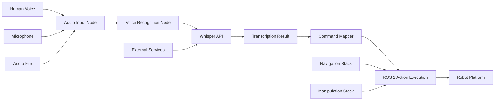

# Detailed Documentation: Voice Command Implementation

This document provides comprehensive documentation for the voice command implementation in the Vision-Language-Action (VLA) system. It covers the architecture, components, implementation details, and best practices for developing voice command capabilities.

## Overview

The voice command implementation in the VLA system provides a complete solution for converting human speech to robotic actions. It encompasses several components working together to handle audio input, perform speech-to-text conversion, interpret commands, and execute appropriate robotic actions.

## System Architecture

### High-Level Architecture



### Component Breakdown

#### 1. Audio Input Node
- **Purpose**: Captures audio from various sources (microphone, files)
- **Key Features**:
  - Real-time audio capture from microphone
  - File-based audio input for testing
  - Audio preprocessing (noise reduction, normalization)
  - Voice activity detection
- **ROS Interface**: 
  - Publishes to: `/vla/audio_input` (AudioData)
  - Parameters: sample_rate, channels, device_index

#### 2. Voice Recognition Node
- **Purpose**: Converts audio to text using OpenAI Whisper API
- **Key Features**:
  - Integration with OpenAI Whisper API
  - Confidence threshold filtering
  - Support for different languages
  - Error handling and retries
- **ROS Interface**:
  - Subscribes to: `/vla/audio_input` (AudioData)
  - Publishes to: `/vla/recognized_text` (String)
  - Service: `transcribe_audio` (TranscribeAudio)

#### 3. Whisper Transcription Service
- **Purpose**: Provides a reusable service for speech-to-text conversion
- **Key Features**:
  - Service-based architecture
  - Audio format validation
  - Performance monitoring
  - Configurable parameters
- **ROS Interface**:
  - Service: `whisper_transcribe_audio` (TranscribeAudio)

#### 4. Command Mapper
- **Purpose**: Maps transcribed text to ROS 2 commands
- **Key Features**:
  - Natural language processing
  - Command recognition patterns
  - Parameter extraction
  - Action execution
- **ROS Interface**:
  - Subscribes to: `/vla/recognized_text` (String)
  - Publishes to: `/cmd_vel` (Twist), navigation actions, etc.

## Implementation Details

### Audio Input Implementation

The audio input system handles the capture and preprocessing of audio signals:

```python
# Key aspects of audio input:
- Uses PyAudio for cross-platform audio capture
- Implements real-time audio processing with queues
- Supports configurable sample rates and channels
- Includes noise reduction and voice activity detection
- Publishes raw audio data to ROS topic
```

**Configuration Parameters**:
- `input_device_index`: Audio input device (use -1 for system default)
- `sample_rate`: Audio sample rate (default: 16000Hz for Whisper compatibility)
- `channels`: Number of audio channels (default: 1 for mono)
- `chunk_size`: Audio chunk size for processing (default: 1024)
- `enable_noise_reduction`: Enable/disable noise reduction (default: True)
- `vad_threshold`: Voice activity detection threshold (default: 0.01)
- `silence_timeout`: Seconds of silence before stopping (default: 5.0)

### Voice Recognition Implementation

The voice recognition component leverages OpenAI's Whisper API:

```python
# Key aspects of voice recognition:
- Uses OpenAI Whisper API for state-of-the-art transcription
- Implements confidence threshold filtering
- Converts audio to required WAV format
- Handles multiple retry attempts on failure
- Supports different Whisper models
```

**Configuration Parameters**:
- `whisper_model`: Whisper model to use (default: 'whisper-1')
- `confidence_threshold`: Minimum confidence for accepted transcriptions (default: 0.8)
- `language`: Language code for transcription (default: 'en')
- `max_audio_duration`: Maximum duration for audio processing (default: 30.0 seconds)
- `max_retries`: Maximum retry attempts (default: 3)
- `request_timeout`: API request timeout (default: 120.0 seconds)

### Command Mapping Implementation

The command mapping system converts natural language to robotic actions:

```python
# Key aspects of command mapping:
- Pattern matching for various command formulations
- Parameter extraction (distances, angles, object names)
- Integration with ROS navigation and manipulation stacks
- Support for complex commands with multiple parameters
- Extensible architecture for adding new command types
```

**Supported Command Types**:
- Movement: "move forward", "turn left", "go backward"
- Navigation: "go to kitchen", "navigate to table"
- Manipulation: "pick up cup", "grasp object"
- Object interaction: "find book", "look for phone"

## Error Handling and Robustness

### Audio-Related Errors
- Microphone unavailability detection
- Audio format incompatibility handling
- Buffer overflow protection
- Noise floor adjustment

### API-Related Errors
- OpenAI API rate limit handling
- Network connectivity issues
- Transcription failure management
- Retry logic with exponential backoff

### Command Execution Errors
- Failed navigation recovery
- Grasping failure handling
- Obstacle avoidance
- Safety constraint violations

## Performance Considerations

### Latency Optimization
- Asynchronous audio processing
- Efficient queue management
- Optimized API call batching
- Minimal preprocessing overhead

### Resource Usage
- Memory-efficient audio buffering
- CPU-optimized signal processing
- Network bandwidth optimization
- Battery-conscious operation

### Throughput Management
- Concurrent request handling
- Queue size management
- Processing rate limiting
- Quality-of-service considerations

## Security and Privacy

### API Key Management
- Secure storage of OpenAI API keys
- Environment variable usage
- Avoiding hardcoding in source code
- Key rotation procedures

### Audio Data Handling
- User privacy in audio processing
- Secure transmission of audio data
- Data retention policies
- Anonymization practices

## Testing and Validation

### Unit Testing
- Audio input validation
- Transcription accuracy testing
- Command parsing verification
- Error handling validation

### Integration Testing
- End-to-end voice command flow
- Multi-component interaction testing
- Performance under load
- Edge case validation

### Acceptance Testing
- Natural language command recognition
- Real-world scenario validation
- User experience testing
- Accessibility verification

## Deployment Guidelines

### System Requirements
- Linux-based system for ROS 2 compatibility
- Python 3.8 or higher
- Microphone access (for live audio)
- Internet connection (for Whisper API)
- ROS 2 Humble Hawksbill installation

### Installation Process
1. Install required Python packages:
   ```bash
   pip install openai pyaudio numpy rclpy
   ```
2. Set up OpenAI API key:
   ```bash
   export OPENAI_API_KEY="your-api-key-here"
   ```
3. Build ROS 2 workspace:
   ```bash
   colcon build
   source install/setup.bash
   ```

### Configuration Steps
- Adjust audio input parameters based on hardware
- Set appropriate confidence thresholds
- Configure language settings
- Validate API connectivity

## Troubleshooting

### Common Issues
- Audio device not found
- API key authentication failures
- High latency in transcription
- Recognition accuracy issues

### Diagnostic Procedures
- Audio input verification
- API connectivity testing
- Log analysis
- Performance profiling

### Resolution Strategies
- Alternative audio devices
- Different Whisper models
- Adjusted confidence thresholds
- Preprocessing optimization

## Best Practices

### For Developers
- Use environment variables for API keys
- Implement proper error handling
- Validate all user inputs
- Follow ROS 2 coding standards

### For Users
- Speak clearly and at moderate pace
- Use consistent command formulations
- Maintain appropriate distance from microphone
- Ensure quiet environment when possible

### For Maintainers
- Regular API key rotation
- Monitor transcription costs
- Update dependencies regularly
- Document configuration changes

## Future Enhancements

### Planned Features
- On-device speech recognition
- Multi-language support
- Speaker identification
- Emotion recognition
- Offline capability

### Research Directions
- Improved natural language understanding
- Context-aware command interpretation
- Multi-modal command integration
- Adaptive learning from user interactions

## Integration with Other VLA Components

### Cognitive Planner
- Transcribed text flows to cognitive planner for complex action sequences
- Context information enhances command interpretation

### Perception Module
- Voice commands can trigger specific perception tasks
- Object names in commands help focus perception processing

### Action Execution
- Mapped commands connect to ROS 2 action servers
- Feedback from action execution can be reported back via voice

This comprehensive implementation provides a solid foundation for voice command processing in VLA systems, balancing accuracy, efficiency, and usability while maintaining robustness and security.